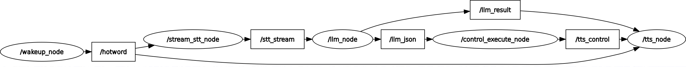
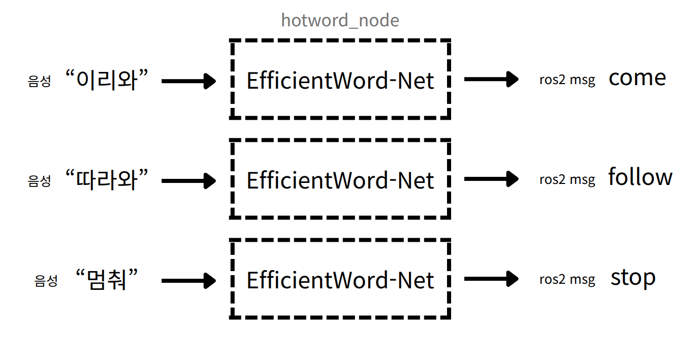
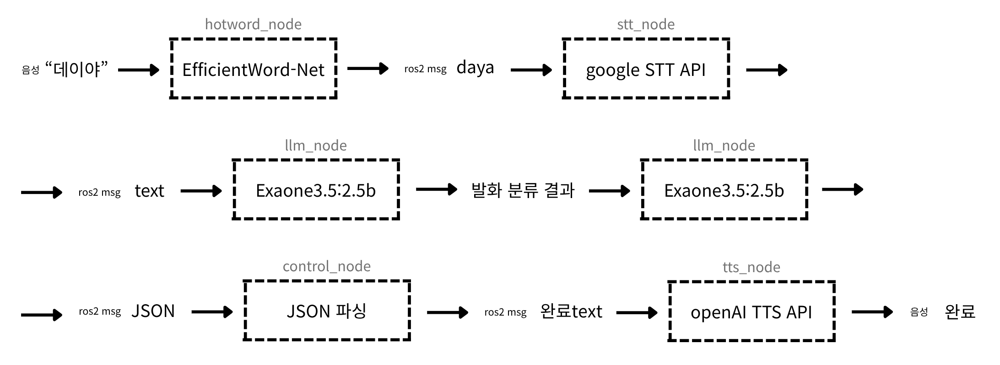
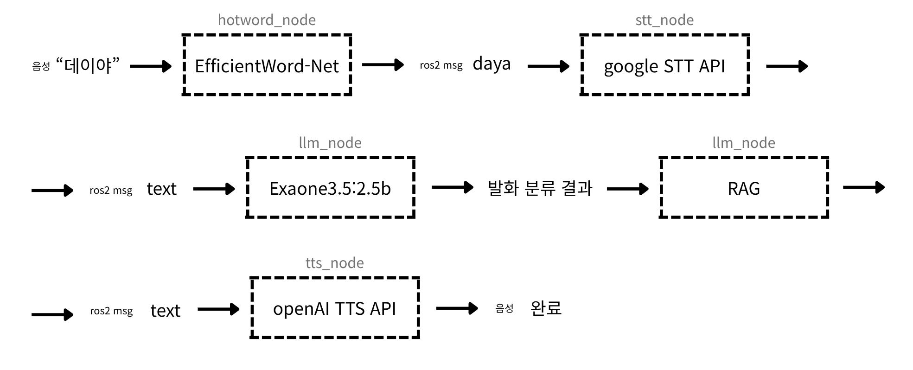

# 인공지능 로봇 집사 Dei

<p>

*AI로 생성한 이미지입니다.
</p>

## 프로젝트 의도
이미 컴퓨팅 파워를 갖춘 로봇청소기에 집사 기능을 추가하면 괜찮지 않을까? 하는 생각으로부터 해당 프로젝트를 시작하게 되었습니다. Jeton Orin nano 보드에 로봇청소기 기능과 AI 기능을 통합하고자 했습니다.

본 레포지토리에는 로봇 집사의 AI 파트만 정리되어 있습니다.

## AI 파트
### Hotword + STT 노드 연계


### Hotword + STT + LLM 노드 연계


### rqt_graph


<br>

## AI 파트 시나리오
### 1. 이동 명령
```text
1. 로봇에게 "이리와" 명령을 내리면 로봇이 사람을 인식해서 해당 위치로 이동한다.
2. 로봇에게 "따라와" 명령을 내리면 로봇이 사람을 인식해서 따라간다.
3. 로봇에게 "멈춰" 명령을 내리면 로봇은 이동을 중지한다.
```

### 2. 음성 IoT 제어 명령
```text
1. 로봇을 불러 TV를 켜달라고 하면 켜준다. (SmartThings)
2. 로봇을 불러 TV를 꺼달라고 하면 꺼준다. (SmartThings)
3. 로봇을 불러 에어컨을 켜달라고 하면 켜준다. (Custom)
4, 로봇을 불러 에어컨을 꺼달라고 하면 꺼준다. (Custom)
```

### 3. 가전제품 QnA
```text
1. 가전 제품에 대한 질문을 하면 로봇이 가전 매뉴얼, 사용설명서를 기반으로 답변한다.
```


## 설계
### 1. 이동 명령
```text
1. 이리와 명령
(a) "이리와" 키워드를 인식한다.
(b) `come` 메시지를 pub한다
---
(c) `come` 메시지를 sub하면 로봇이 한 바퀴 돌면서 사람을 찾는다.
(d) 사람을 찾았으면 해당 위치의 거리를 pub한다.
(e) 해당 위치의 웨이포인트를 찍는다.
(f) 웨이포인트까지 자율주행한다.
```

```text
2. 따라와 명령
(a) "따라와" 키워드를 인식한다.
(b) `follow` 메시지를 pub한다.
---
(c) `follow` 메시지를 sub하면 로봇이 한 바퀴 돌면서 사람을 찾는다.
(d) 사람을 찾았으면 해당 위치의 거리를 pub한다.
(e) 해당 위치의 웨이포인트를 찍는다.
(f) 웨이포인트까지 자율주행한다.
(g) (d) ~ (f)를 반복한다.
```

```text
3. 멈춰 명령
(a) "멈춰" 키워드를 인식한다.
(b) `stop` 메시지를 pub한다.
---
(c) `stop` 메시지를 sub하면 로봇은 모든 이동을 멈춘다.
```

### 2. 음성 IoT 제어 명령
```text
1. TV On/Off (SmartThings)
(a) "데이야" 키워드를 인식한다.
(b) `daya` 메시지를 pub한다.
(c) 음성을 텍스트로 변환한다.
(d) 변환된 텍스트를 LLM을 통해 JSON 형식으로 정리한다.
(e) JSON을 파싱하여 제어 함수를 호출한다.
```

```text
2. 에어컨 On/Off (Custom)
(a) "데이야" 키워드를 인식한다.
(b) `daya` 메시지를 pub한다.
(c) 음성을 텍스트로 변환한다.
(d) 변환된 텍스트를 LLM을 통해 JSON 형식으로 정리한다.
(e) JSON을 파싱하여 제어 함수를 호출한다.
```

### 3. 가전제품 QnA
```text
(a) "데이야" 키워드를 인식한다.
(b) `daya` 메시지를 pub한다.
(c) 음성을 텍스트로 변환한다.
(d) 텍스트에 대한 답변을 RAG한다.
```

## 구현
### 1. 이동 명령


### 2. 음성 IoT 제어 명령


### 3. 가전제품 QnA


## 설치 방법
### 1. src 폴더 생성 후 git clone
```bash
git clone https://github.com/SHIN-DONG-UK/Dei.git
```

### 2. 노드별 python 가상환경 구축
#### 2-1. src 폴더와 같은 레벨에 envs 폴더 생성
#### 2-2. envs안에 다음 가상환경 생성
#### 2-3. hotword  
  ```bash
  python3 -m venv hotword_venv
  source hotword_env/bin/activate
  pip install -r ../src/nodes/hotword/requirements.txt
  ```
#### 2-4. stt  
  ```bash
  python3 -m venv stt_venv
  source stt_venv/bin/activate
  pip install -r ../src/nodes/stt/requirements.txt
  ```
#### 2-5. llm  
  ```bash
  python3 -m venv llm_venv
  source llm_venv/bin/activate
  pip install -r ../src/nodes/llm/requirements.txt
  ```
#### 2-6. tts
  ```bash
  python3 -m venv tts_venv
  source tts_venv/bin/activate
  pip install -r ../src/nodes/tts/requirements.txt
  ```

## 환경변수 설정
### python-dotenv 설치
```shell
pip install python-dotenv   
```

### 사용 방법
```python
import os
from dotenv import load_dotenv

# .env 파일 로드
load_dotenv()

# 환경변수 사용
api_key = os.getenv("API_KEY")
database_url = os.getenv("DATABASE_URL")

print(f"API Key: {api_key}")
print(f"Database URL: {database_url}")
```

### ~/.bashrc에 반영
```
gedit ~/.bashrc
```

- 아래와 같이 export 적용
```
# API KEys
# OpenAI
export OPENAI_API_KEY="your"
# SmartThings
export SMARTTHINGS_API_TOKEN="your"
export DEVICE_ID="your"
```

## 실행 방법
