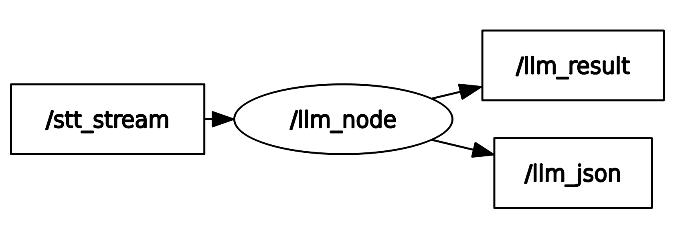

# llm_node.py

### 설명
- Text로 변경된 사용자의 발화를 입력받아, 적당한 응답을 Large-Language Model을 통해 생성하는 노드

### 실행 흐름
1. 입력을 llm에 넣어 4가지로 분류한다.  
   1. qna_iot
   2. qna_general
   3. control
   4. error
2. 분류 결과에 따라 프롬프트를 달리하여 응답을 생성한다.
3. 응답 결과를 publish한다.

### rqt_graph

